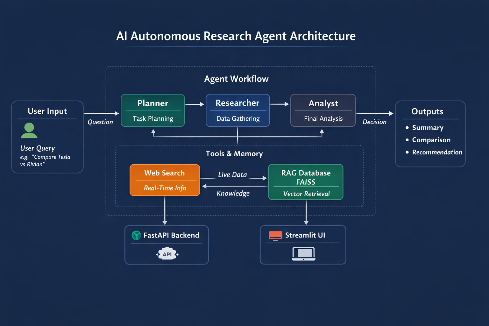
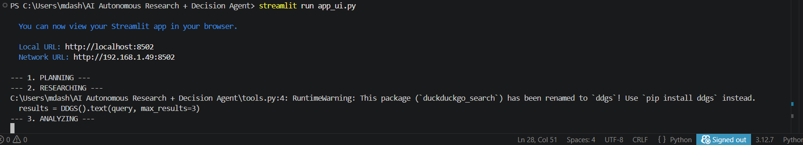

# 🚀 AI Autonomous Research & Decision Agent

## 🔗 Live Demo

👉 https://your-live-demo-link.streamlit.app

---

## 📌 Overview

This project is a **production-grade AI system** that performs automated research, competitor analysis, and decision-making using a **multi-agent architecture**.

It simulates how real analysts work by breaking problems into steps, gathering data, and generating structured recommendations.

---

## 🧠 Key Features

* 🤖 **Multi-Agent System (LangGraph)**

  * Planner → Researcher → Analyst workflow
* 📚 **RAG (Retrieval-Augmented Generation)** using FAISS
* 🌐 **Web Search Tool Integration** (real-time data)
* ⚡ **FastAPI Backend** for API access
* 🖥️ **Streamlit UI** for interactive usage
* 🧩 Modular and production-ready architecture

---

## 🏗️ Architecture



**Flow:**
User Query → Planner → Research (RAG + Web) → Analyst → Final Decision

---

## 🖼️ Screenshots

### 🔹 UI Input



### 🔹 Agent Reasoning Steps


### 🔹 Final Output


---

## ⚙️ Tech Stack

* **LLM:** Ollama (Llama3.1)
* **Agent Framework:** LangGraph
* **RAG:** FAISS + Embeddings
* **Backend:** FastAPI
* **Frontend:** Streamlit
* **Tools:** DuckDuckGo Search

---

## 📂 Project Structure

```
ai-autonomous-agent/
│
├── agents/        # LangGraph multi-agent logic
├── rag/           # FAISS vector store
├── tools/         # Web search integration
├── api/           # FastAPI backend
├── ui/            # Streamlit frontend
├── screenshots/   # Images for README
└── README.md
```

---

## ▶️ Run Locally

### 1. Clone repo

```
git clone https://github.com/arshiefatima/ai-autonomous-research-agent.git
cd ai-autonomous-research-agent
```

### 2. Install dependencies

```
pip install -r requirements.txt
```

### 3. Start Ollama

```
ollama run llama3.1
```

### 4. Run UI

```
streamlit run ui/app_ui.py
```

---

## 🔌 Run API

```
uvicorn api.main:app_api --reload
```

Open in browser:
http://127.0.0.1:8000/run?query=Compare Tesla vs Rivian

---

## 🧪 Example Query

```
Compare Tesla vs Rivian for investment decision
```

---

## 📊 Key Highlights

* Reduced manual research effort by automating analysis workflow
* Implemented multi-agent orchestration using LangGraph
* Improved response quality using RAG + real-time data
* Built end-to-end deployable AI system

---

## 🚀 Future Improvements

* Add memory (conversation history)
* Add evaluation metrics (latency, accuracy)
* Deploy on AWS / Render
* Add authentication

---

## 👩‍💻 Author

**Arshie Fatima**
GitHub: https://github.com/arshiefatima

---
